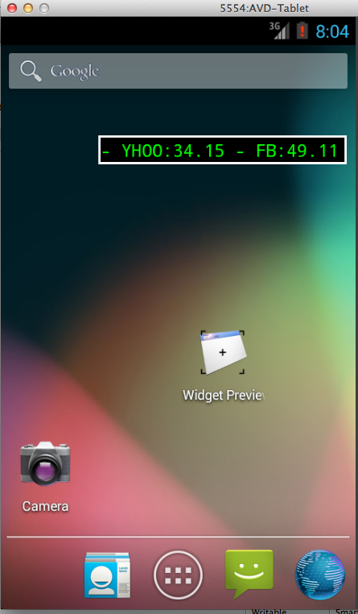

AndroidWidgetDemo
=================

A demo of how to make Android Widgets for my October Nashville Mobile Users Group presentation!

It is just a simple scrolling stock ticker.  It should just show how to create a widget - nothing more.  It isn't super error-free - in fact, I bet it has tons of errors!  Ideally, I'd like to extend it to have a configuration activity, a configurable number of scrollers, configurable colors, configurable update times, etc.

